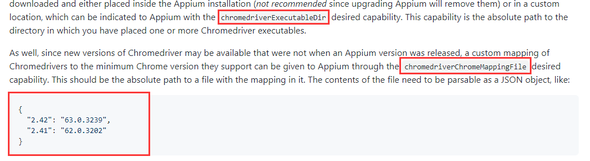

## 一、app分类
#### 原生app
#### web app
####混合app

## 二、appium引擎
- android 是 uiautomator2
- ios 是 xcuitest

## 三、APP自动化准备的环境
#### 必要环境：
- server： appium_server or appium_desktop
  + 单独安装appium_server需要：node.js的npm包管理工具
- client: appium-python-client [python的第三方包]
- emulator: android_studio [模拟器]
  + 需要java1.8 环境：安装JDK
  + 需要安装android studio  
- appcrawler：自动遍历工具(区别于monkey)
#### 原生app 额外环境：
- 模拟器上需要安装被测APP
- 自动化脚本添加：appPackage和appActivity参数
#### web app 额外环境：
- 模拟器上需要被测浏览器
- PC端需要安装Chrome浏览器
- 下载对应手机浏览器的driver,放置到appium的安装目录下
  + chromedriver路径：通过运行web app脚本在appium_sever的日志中找到
  + C:\Users\用户\AppData\Local\Programs\Appium\resources\app\node_modules\appium\node_modules\appium-chromedriver\chromedriver\win'
  + 当driver比较多时，可以用指定driver路劲和文件配置来支持
    * 在desired_cap参数中加入：chromedriverExecutableDir or chromedriverChromeMappingFile
  
- 自动化脚本添加：browser和chromedriverExecutable
#### 混合app 额外环境：
- app需要打开webview开关
- android6.0支持webview

#### 用到的命令：
- adb logcat |grep -i activitymanager：查看appPackage
- adb shell pm list package: 查看模拟器安装的app
- adb shell pm list package |grep "xxx": 查看某个安装的app  
- adb shell pm dump app名称： 查看app的信息
- adb shell pm dump app名称 |grep version: 查看app的版本
  + adb shell pm dump com.android.chrome |grep version
    
#### 获取 App 的信息
- 获取当前元素界面：adb shell dumpsys activity top
- 获取当前activity: adb shell dumpsys window | findstr mCurrent  
- 获取任务列表：adb shell dumpsys activity activities
- 获取 app 的 package 和 activity：
  + adb logcat | grep -i displayed
  + adb logcat |grep -i activitymanager  
- 启动应用:adb shell am start -W -n "com.xueqiu.android/.view.WelcomeActivityAlias -S

#### 查找app元素工具
- 原生app
  * 需要用MobileBy
  * appium_desktop 的inspect(录制功能)
  * SDK自带的uiautomatorview.bat同步模拟器页面
    + 用法：driver.find_element_by_android_uiautomator(“表达式”)
    
- web app
  * 用By就行
  * 用PC Chrome的inspect链接来定位web元素
    + 链接：chrome://inspect/#devices 
  
- 混合app
  * 定位工具：PC Chrome的inspect
  * 需要上下文（app->web）
    + self.driver.contexts->list
    + 要访问web页面时，需要切换context:
      - self.driver.switch_to.context(self.driver.contexts[-1])
  
#### capbility
- https://github.com/appium/appium/blob/master/docs/cn/writing-running-appium/caps.md
- newCommandTimeout
- udid: 多设备时用【deviceName并没有用】
- autoGrantPermissions
