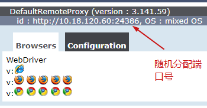
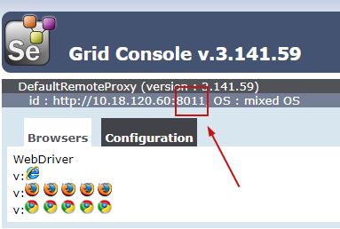

#### wiki: https://www.selenium.dev/documentation/en/grid/grid_3/setting_up_your_own_grid/
# 分布式测试用例编写
```code
from selenium import webdriver
selenium_grid_url = "http://127.0.0.1:4444/wd/hub"

# Create a desired capabilities object as a starting point.
capabilities = DesiredCapabilities.CHROME.copy()
capabilities['platform'] = "WINDOWS"
capabilities['version'] = "10"

# Instantiate an instance of Remote WebDriver with the desired capabilities.
driver = webdriver.Remote(desired_capabilities=capabilities,
                          command_executor=selenium_grid_url)
```

# Grid3的组件：hub&&node
## hub
#### 启动方式：
- 快速启动hub: java -jar selenium-server-standalone-3.141.59.jar -role hub
- 配置文件启动hub: java -jar selenium-server-standalone-3.141.59.jar -role hub -hubConfig hubConfig.json -debug
  - hubConfig.json
  ```json
  {
    "_comment" : "Configuration for Hub - hubConfig.json",
    "host": ip,
    "maxSession": 5,
    "port": 4444,
    "cleanupCycle": 5000,
    "timeout": 300000,
    "newSessionWaitTimeout": -1,
    "servlets": [],
    "prioritizer": null,
    "capabilityMatcher": "org.openqa.grid.internal.utils.DefaultCapabilityMatcher",
    "throwOnCapabilityNotPresent": true,
    "nodePolling": 180000,
    "platform": "WINDOWS"
  }
  ```

#### 其他：
- 管理node链接：http://localhost:4444/grid/console
- 连接说明：
```log
11:34:04.055 INFO [Hub.start] - Nodes should register to http://10.18.120.60:4444/grid/register/
11:34:04.055 INFO [Hub.start] - Clients should connect to http://10.18.120.60:4444/wd/hub
```
- 日志文件排查故障：java -jar selenium-server-standalone-3.141.59.jar -role hub -log log.txt
- debug模式调试：java -jar selenium-server-standalone-3.141.59.jar -role hub -debug 

## node
#### 启动方式：
- 快速启动node: java -jar selenium-server-standalone-3.141.59.jar -role node -hub http://localhost:4444
  ```
  
  ```
  - -port: 指定某个端口，否则自由分配一个端口给这个node节点
    ```
    
    ```
  - -host: 允许用另一台机器方位hub/node, 否则默认是宿主机
- 配置文件启动：java -jar selenium-server-standalone-3.141.59.jar -role node -nodeConfig node1Config.json
  - node1Config.json
  ```json
  {
    "capabilities":
    [
      {
        "browserName": "firefox",
        "marionette": true,
        "maxInstances": 5,
        "seleniumProtocol": "WebDriver"
      },
      {
        "browserName": "chrome",
        "maxInstances": 5,
        "seleniumProtocol": "WebDriver"
      },
      {
        "browserName": "internet explorer",
        "platform": "WINDOWS",
        "maxInstances": 1,
        "seleniumProtocol": "WebDriver"
      },
      {
        "browserName": "safari",
        "technologyPreview": false,
        "platform": "MAC",
        "maxInstances": 1,
        "seleniumProtocol": "WebDriver"
      }
    ],
    "proxy": "org.openqa.grid.selenium.proxy.DefaultRemoteProxy",
    "maxSession": 5,
    "port": -1,
    "register": true,
    "registerCycle": 5000,
    "hub": "http://localhost:4444",
    "nodeStatusCheckTimeout": 5000,
    "nodePolling": 5000,
    "role": "node",
    "unregisterIfStillDownAfter": 60000,
    "downPollingLimit": 2,
    "debug": false,
    "servlets" : [],
    "withoutServlets": [],
    "custom": {}
  }
  ```
  
# Grid4的组件：Router(路由组件)、Distributor(分发组件)、SessionQueue(会话队列)、SessionMap(会话map)、EventBus(事件总线)、nodes(节点)
## Router(路由组件)
- 处理请求的组件，保证负载均衡
- 请求处理过程：
  - 接收外部请求，判断请求时新的会话还是已有会话
  - 新的会话发给session queue，会话队列将请求加入队列中，此时队列进入等待状态，等待能否收到请求的响应【此响应指的是：sessionID与node是否能形成map】
    - 在请求超时时间内，事件总线触发一个事件，分发服务器接收此事件并轮询队列，尝试创建一个会话【主要看新会话的请求功能与node是否匹配;匹配后是否node是否有可用槽】
      - 如果会话创建成功，则session queue收到请求的响应，并在接收到事件时，响应客户端
        - 会话成功的条件：新会话的请求功能与已注册节点功能匹配 并且 在请求超时时间内，能够在该node获取到可用槽
      - 如果会话创建失败，则session queue将拒绝请求，client将收到响应
        - 失败的条件： 新会话的请求功能在任何已注册的节点中不存在 或者 在请求超时时间内，没有获取到该node的可用槽
    - node可用槽的获取原理：
      - 如果存在可用槽，则分发服务器将会话ID和node关联存储到session map中
      - 如果没有可用槽，则分发服务器会要求session queue将请求添加到队列的前面，分发服务器会依据请求重试间隔进行请求重试
        - 如果请求成功，则分发服务器将会话ID和node关联存储到session map中
        - 如果最终请求超时，则拒绝该请求
  - 已有会话发给session map
  - 收到session xxx的返回node结果，将请求转发给对应node节点
## Distributor(分发组件)
- 管理所有的节点和功能
- 处理过程：
  - 接收新的会话请求，找到合适的节点，在节点上创建会话 
  - 将会话id和执行的会话节点映射到session map中
## SessionQueue(会话队列)
- 处理队列的所有操作，比如添加操作队列，设置请求超时和请求充实间隔等配置参数
## SessionMap(会话map)
- 一个数据存储，存储sessionID-node的map信息
## EventBus(事件总线)
- 充当通信路径，主要在节点、分发服务器、会话队列、会话映射（session-map）之间进行内部的消息通信，避免昂贵的http调用
## nodes(节点)
- 管理自身可用的浏览器插槽，可在grid中出现多次
- 处理过程：
  - 通过事件总线将自身注册到分发组件中
  - 只执行接收到的命令，不评估、不判断、不控制任何事情
  
# Grid4 启动
## 独立启动模式
- java -jar selenium-server-4.0.0-alpha-7.jar standalone
## Hub & node模式
#### Hub相当于：Router(路由组件)、Distributor(分发组件)、SessionQueue(会话队列)、SessionMap(会话map)、EventBus(事件总线)
- java -jar selenium-server-4.0.0-alpha-7.jar hub
- java -jar selenium-server-4.0.0-alpha-7.jar node --detect-drivers
- 增加GraphQL, 这是一种查询必要数据并得到完全相同结果的新方法
  - curl -X POST -H "Content-Type: application/json" --data '{ "query": "{grid{uri}}" }' -s http://localhost:4444/graphql | jq .
## 分布式模式：
- step1 启动事件总线：java -jar selenium-server-4.0.0-alpha-7.jar  event-bus
- step2 启动会话映射：java -jar selenium-server-4.0.0-alpha-7.jar sessions
- step3 启动会话队列：java -jar selenium-server-4.0.0-alpha-7.jar sessionqueuer
- step4 启动分发服务器：java -jar selenium-server-4.0.0-alpha-7.jar distributor --sessions http://localhost:5556 --sessionqueuer http://localhost:5559 --bind-bus false
- step5 启动路由器：java -jar selenium-server-4.0.0-alpha-7.jar router --sessions http://localhost:5556 --distributor http://localhost:5553 --sessionqueuer http://localhost:5559
- step6 添加node：java -jar selenium-server-4.0.0-alpha-7.jar node --detect-drivers
